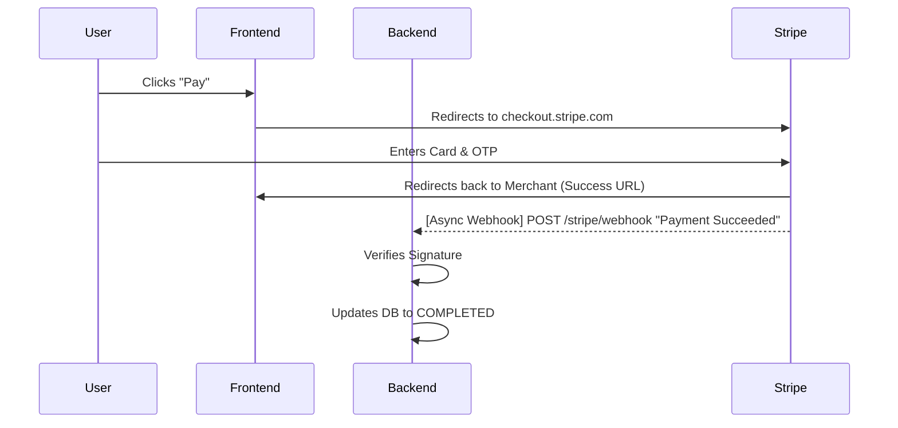
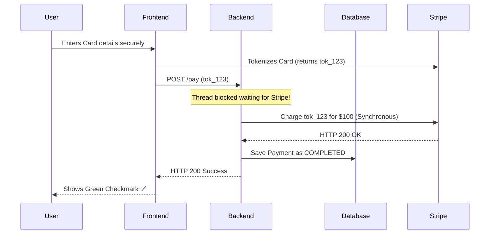
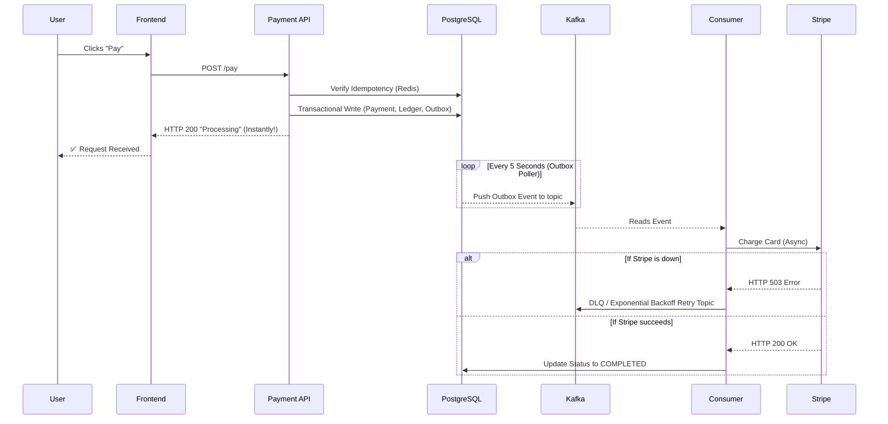
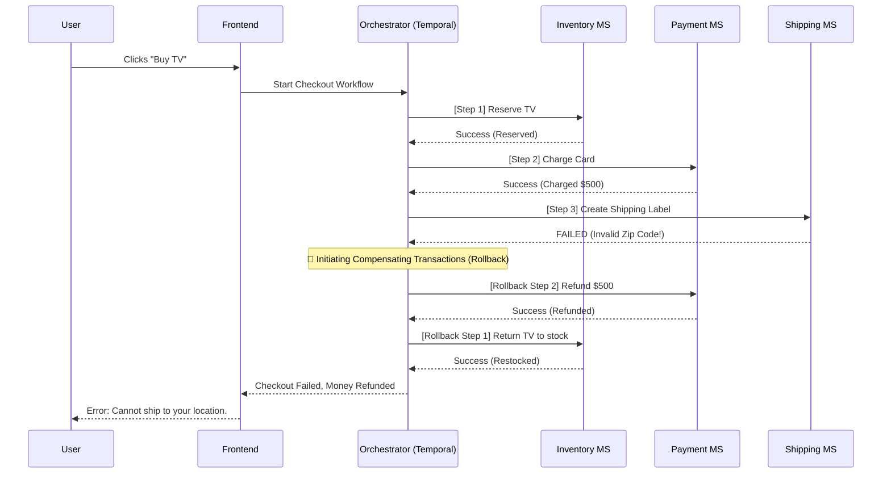

# Payment Systems High Level Design (HLD)

This document visualizes the 4 major payment architectures used in the tech industry today, ranging from simple MVPs to Enterprise-grade distributed systems.

---

## 1. The Redirect Flow (Frontend Checkout / Webhooks)
**Use Case:** Small e-commerce, MVPs, Shopify stores.
**Pros:** Easy to build, PCI compliance handled by Stripe.
**Cons:** Slow UX, no control over the checkout experience, redirect drops.

---

## 2. Direct Server-to-Server (Synchronous API)
**Use Case:** Startups wanting a custom UX, simple internal apps.
**Pros:** Clean UX, user never leaves the site.
**Cons:** Blocks HTTP threads, user stares at loading screen, fails completely if Stripe is down.

---

## 3. The Asynchronous Event-Driven Architecture (What we built!)
**Use Case:** Wallets, Subscriptions, Payouts, Medium-Large Enterprises.
**Pros:** Lightning-fast UX, survives database crashes, handles network outages with Kafka retries.
**Cons:** Requires Kafka setup, Eventual Consistency, not suited for OTPs.

---

## 4. The State Machine / Saga Orchestration (Netflix / Uber scale)
**Use Case:** Complex e-commerce flows (Flight Booking, Multi-merchant carts).
**Pros:** Perfect rollback capabilities (Sagas), impossible to lose state, orchestrates 10+ microservices.
**Cons:** Extremely complex, requires tools like Temporal, AWS Step Functions, or Netflix Conductor.

